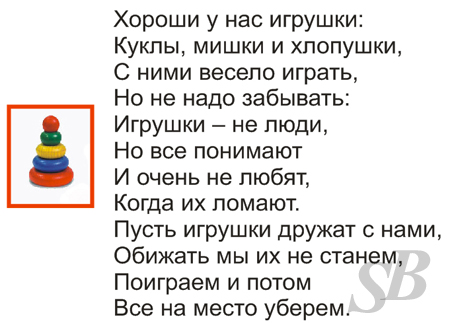
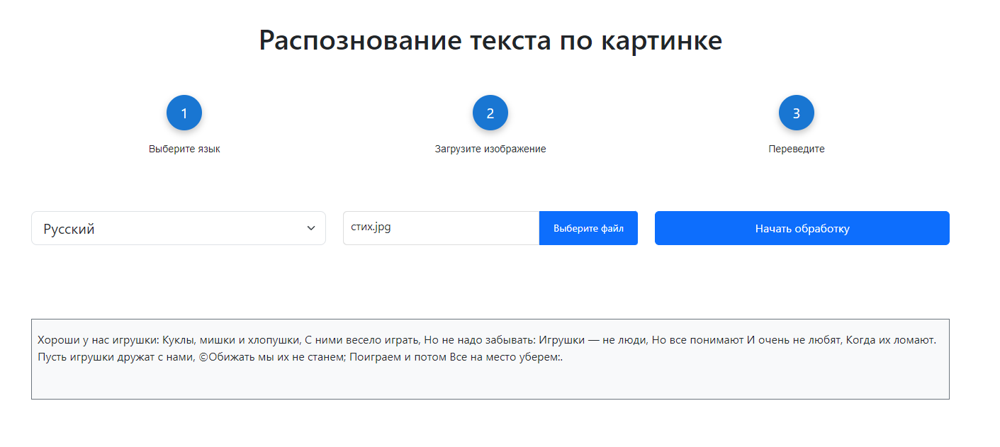

# Распознование текста с изображения

### Написано с использованием React и TypeScript. Для распознования текста используется библиотека Tesseract.js

Ссылка на сайт - [https://mos-places.onrender.com](https://text-recognizing.onrender.com)

***

### Пример работы приложения:

Изображение с текстом:

Результат:

